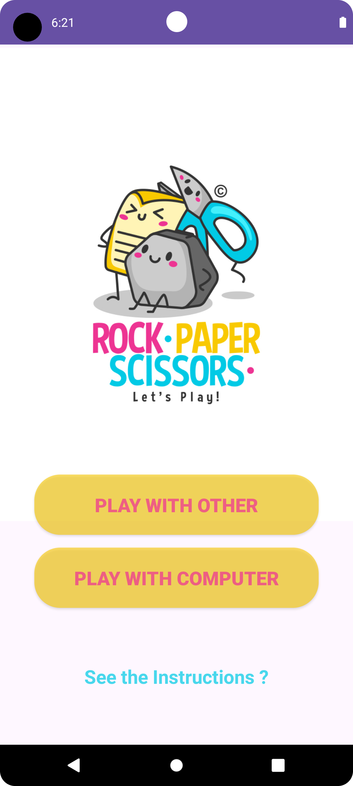
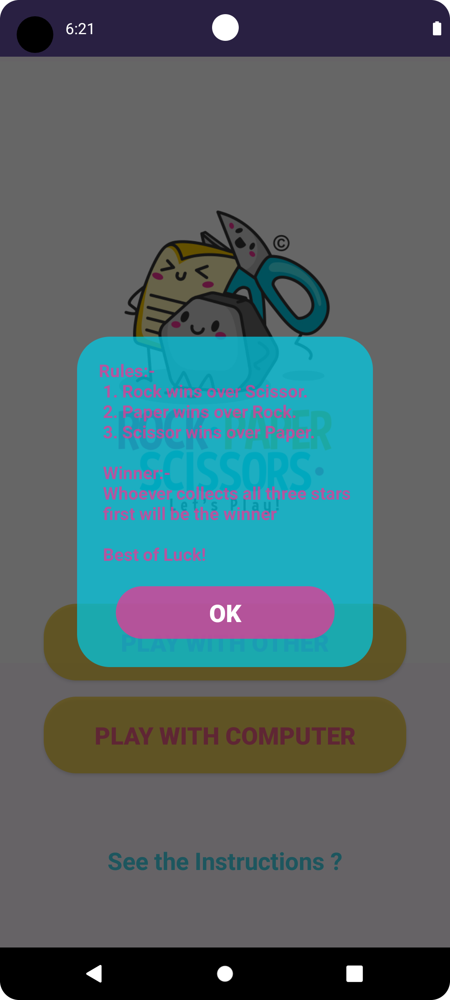
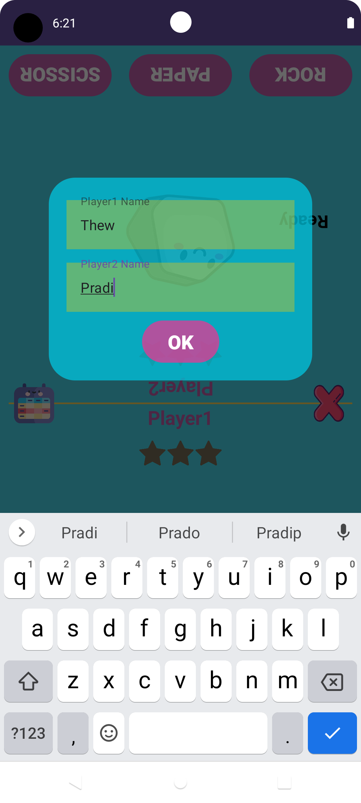
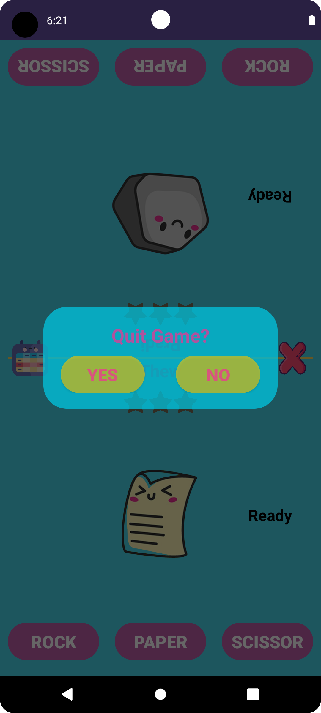
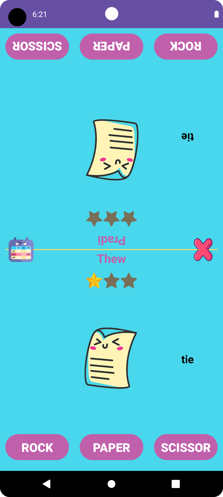
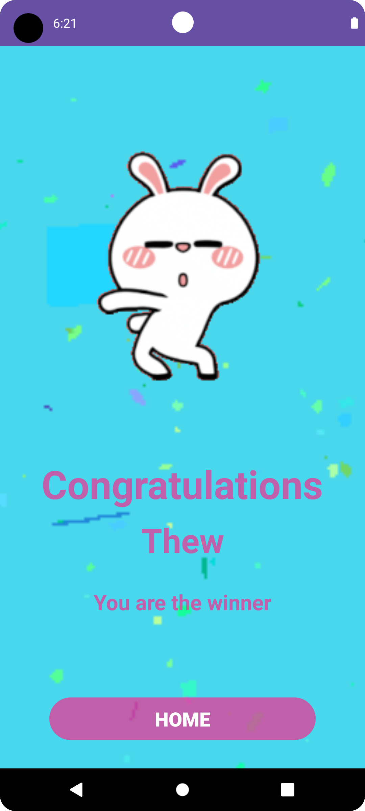
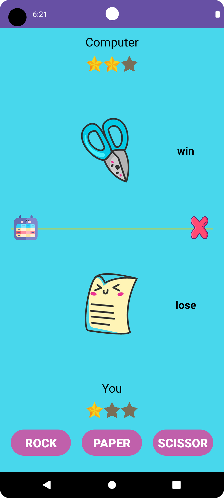
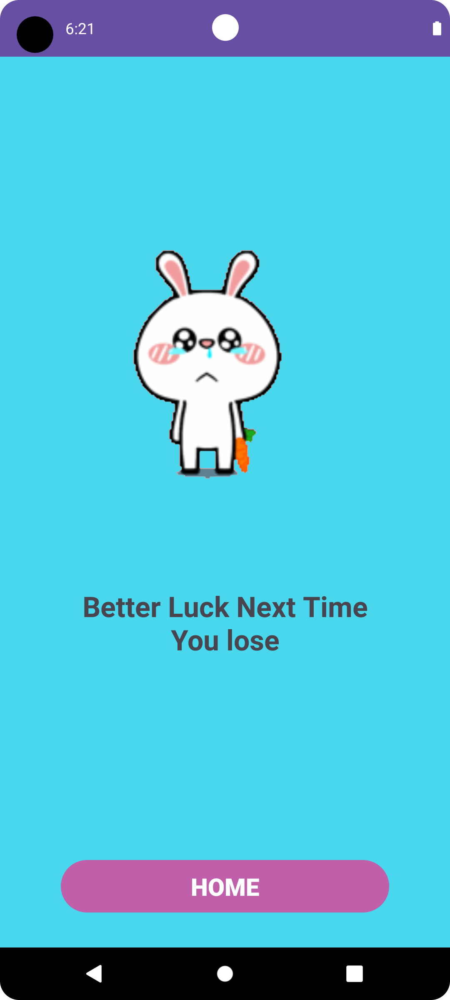
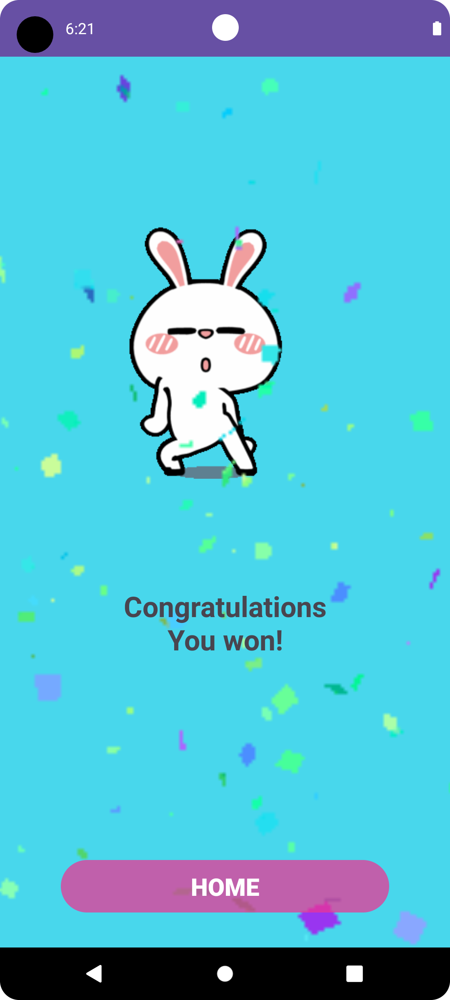

<p align="center">
    <a>
    
    </a>
    <h1 align="center">Rock Paper Scissor App</h1>
</p>

## About
The Rock Paper Scissor game app is a classic and entertaining game that brings the age-old hand game to your fingertips. It offers a fun and interactive way to challenge your friends or play against the computer in a battle of wits and strategy.

## Features:
<b>Player vs. Player:</b> Challenge your friends or family members to a friendly match of Rock Paper Scissor.<br>
<b>Player vs. Computer:</b> Test your skills against the computer AI and see if you can outsmart it.<br>
<b>Interactive Graphics:</b> Engage with vibrant and eye-catching graphics that enhance the overall gaming experience.<br>

## Instructions:
<b> How to Play: </b>
1.	Choose your gesture (rock, paper, or scissor) by tapping the corresponding button on the screen.<br>
2.	Wait for your opponent (either another player or the computer) to make their move.<br>
3.	Compare gestures to determine the winner.<br>
4.	Rock crushes scissor, scissor cuts paper, paper covers rock.<br>
5.	The player with the winning gesture earns a star.<br>
6.	Whoever collects all three stars first will be the winner.


## Screenshots

<div style="display:flex;">
  <p align="center">



    </p>

</div>
<br>
<div style="display:flex;">
  <p align="center">



    </p>
</div>
<br>
<div style="display:flex;">
  <p align="center">



    </p>
</div>

## 🚀 Getting Started

### Prerequisites
*   Android Studio 
*   Java JDK

### Language Used 


## 🔨 Build and Run Application

Follow this steps to get Working Project!
```
1. Clone this repository or download file
2. Extract zip if downloaded code
3. Open project in Android Studio
4. Wait while Android Studio Download gradle or required files
5. Hit Run Button !
```


